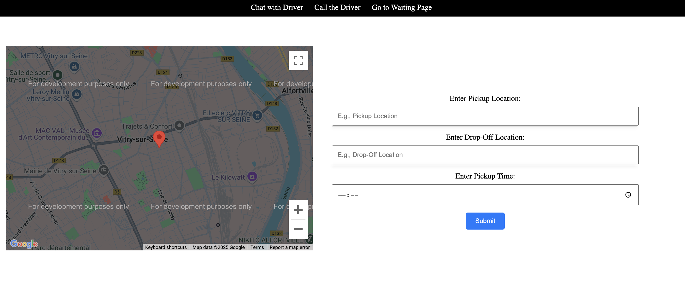
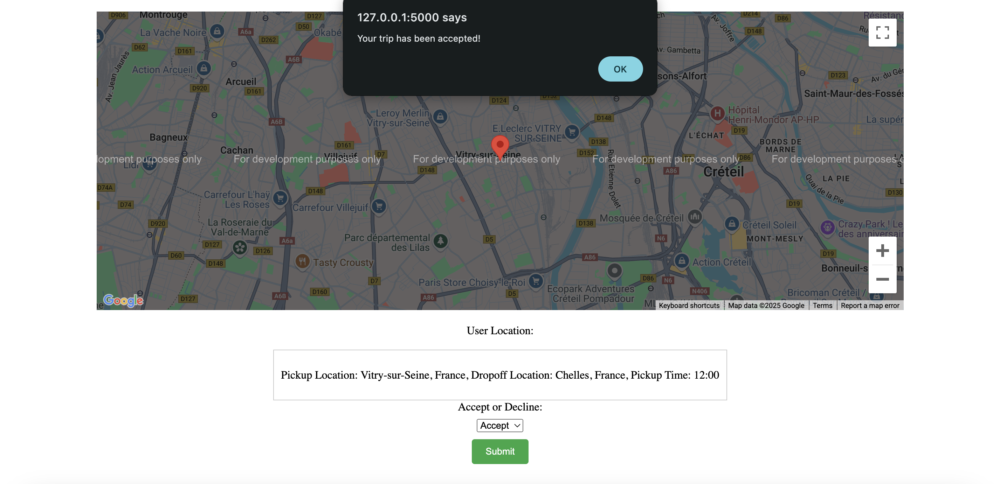

# Uber Clone

This is a Flask-based ride-sharing application that allows users to register as customers or drivers, book trips, and interact through chat functionality. The application includes essential features such as user authentication, trip management, and payment processing.

## Features

- **User Registration**: Separate registration forms for customers and drivers.
- **Login System**: Secure login functionality for both user types.
- **Trip Booking**: Customers can book trips by providing pickup and drop-off locations and pickup time.
- **Driver Management**: Drivers can view assigned trips.
- **Real-time Chat**: Integrated chat functionality using Flask-SocketIO.
- **Payment Processing**: Securely handle payment data.

## Screenshots

### Main Page


### Driver Page


### Customer Trip Booking


## Installation

### Prerequisites

- Python 3.8+
- Flask
- Flask-SocketIO
- Flask-WTF
- Flask-Login

### Steps

1. Clone the repository:
   ```bash
   git clone https://github.com/https://github.com/sathyagnanou/Uber-clone.git
   ```

2. Navigate to the project directory:
   

3. Run the application:
   ```bash
   python app.py
   ```
   
## Usage

1. Register as a customer or driver.
2. Login with your credentials.
3. For customers:
   - Book a trip by entering pickup and drop-off locations and pickup time.
4. For drivers:
   - View assigned trips and manage bookings.
5. Use the chat feature to communicate in real-time.
6. Process payments securely through the app.

## Database Setup

The application uses SQLite for storing user and trip data. The following databases are created during initialization:

- **Users Database**: Stores customer information.
- **Drivers Database**: Stores driver information.
- **Trips Database**: Stores trip details.

## Technologies Used

- **Flask**: Backend framework for web application.
- **SQLite**: Lightweight database for data storage.
- **Flask-SocketIO**: Real-time communication using WebSockets.
- **WTForms**: Form handling and validation.
- **Flask-Login**: User authentication.

